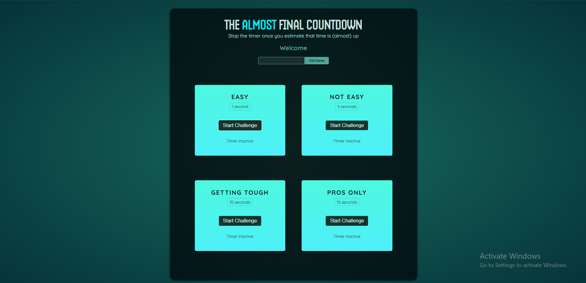
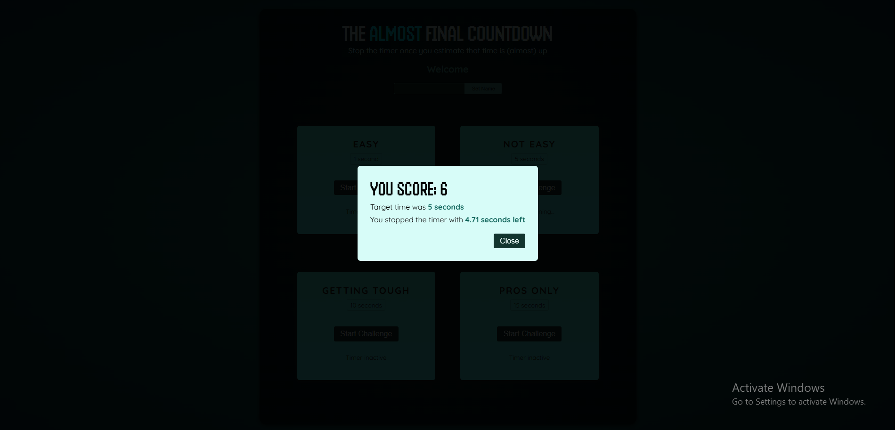
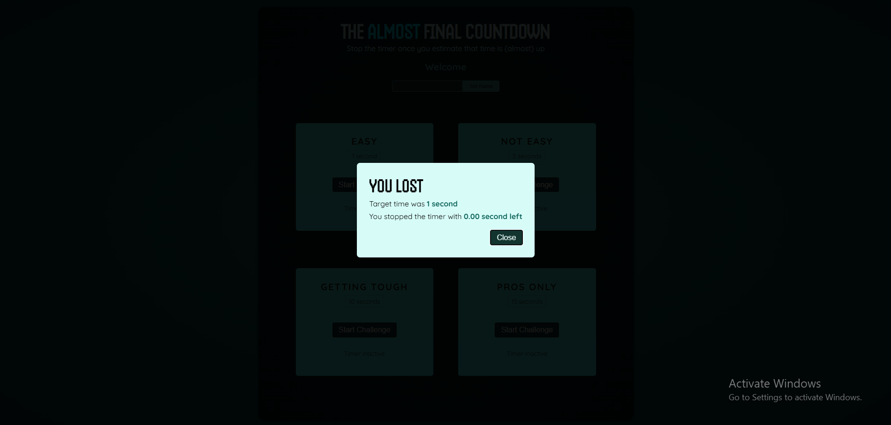

# ⏱️ Timer Challenge

A simple and interactive **Timer Challenge** built with React.
The user starts a countdown timer and tries to stop it as close as possible to the target time. The application calculates a score based on how accurately the user stops the timer.

## 📸 Preview







## ✨ Features

* Start a timer challenge with a specific target time.
* Stop the timer manually and calculate a score.
* Automatically end the challenge when the timer reaches zero.
* Display the remaining time with two decimal places.
* Show the user's score when they stop the timer.
* Display a "You Lost" message when the timer runs out.
* Restart the challenge using the result modal.
* Allow the player to enter and update their name.
* Reusable React components.

## 🛠️ Technologies Used

* **React**
* **JavaScript (ES6+)**
* **HTML**
* **CSS**
* **React Hooks**

  * `useState`
  * `useRef`
  * `useImperativeHandle`
* **React Portals**

## 📂 Main Components

### `Player`

Handles the player's name.

* Uses `useState` to store the entered name.
* Uses `useRef` to access the input element directly.
* Updates the displayed player name when the user clicks **Set Name**.

### `TimerChallenge`

Controls the timer challenge.

* Stores the remaining time using `useState`.
* Uses `useRef` to store the `setInterval` ID.
* Starts and stops the timer.
* Automatically opens the result modal when the timer reaches zero.

### `ResultModal`

Displays the challenge result.

* Shows the player's score when they stop the timer.
* Displays a loss message if the timer reaches zero.
* Uses `forwardRef` and `useImperativeHandle` to expose the `open()` method to the parent component.
* Uses a React Portal to render the modal outside the normal component hierarchy.

## 🧠 React Concepts Practiced

This project was built to practice several important React concepts:

* State management with `useState`
* DOM references with `useRef`
* Exposing custom component methods with `useImperativeHandle`
* Working with `forwardRef`
* Conditional rendering
* Event handling
* `setInterval` and timers
* React Portals
* Reusable components
* Passing data through props

## 🎯 How the Score Works

The score is calculated based on how close the user stops the timer to the target time.

The closer the remaining time is to zero, the higher the score.

```js
const score = Math.round(
  (1 - remainingTime / (targetTime * 1000)) * 100
);
```

If the timer reaches zero before the user stops it, the challenge is considered lost.

## 🚀 Getting Started

Clone the repository:

```bash
git clone https://github.com/yasmin528/Timer-Challenge.git
```

Navigate to the project:

```bash
cd <project-folder>
```

Install the dependencies:

```bash
npm install
```

Start the development server:

```bash
npm run dev
```

Open the local development URL provided by Vite in your browser.

## 📸 Screenshots

The project includes three screenshots showing the application in different states:

* `screenshot1.png`
* `screenshot2.png`
* `screenshot3.png`

Make sure these files are located in the **same folder as `README.md`** so the preview images appear correctly on GitHub.

## 📚 Learning Purpose

This project is part of my journey learning **React** and was created to practice working with refs, imperative APIs, timers, state, portals, and reusable components.

## 🔮 Possible Improvements

* Add sound effects when the timer finishes.
* Add difficulty levels.
* Add a leaderboard.
* Add animations for the result modal.
* Improve mobile responsiveness.
* Add a history of previous scores.

## 📄 License

This project was created for learning and educational purposes.
